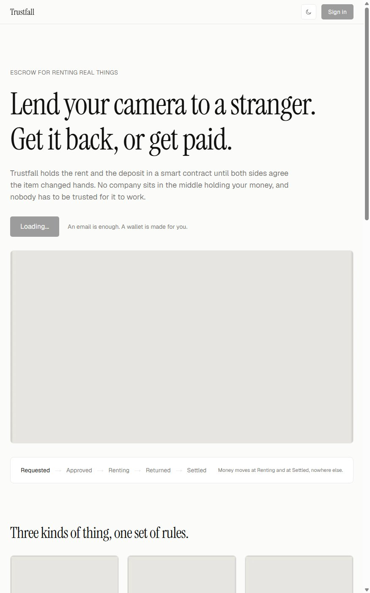
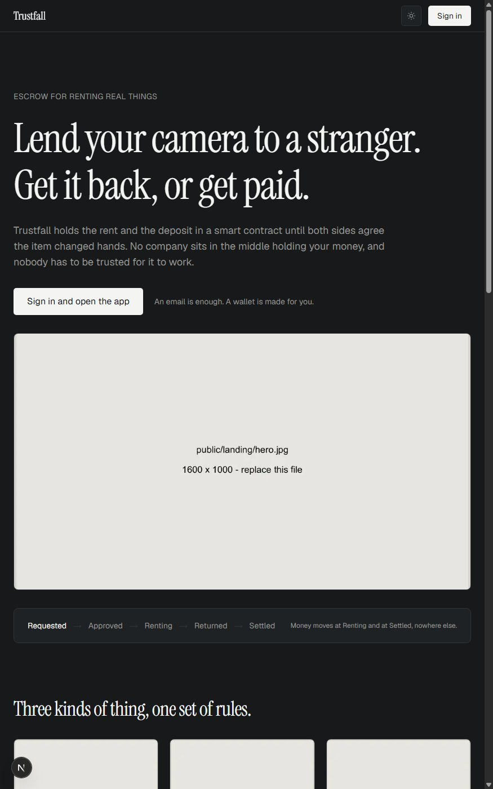
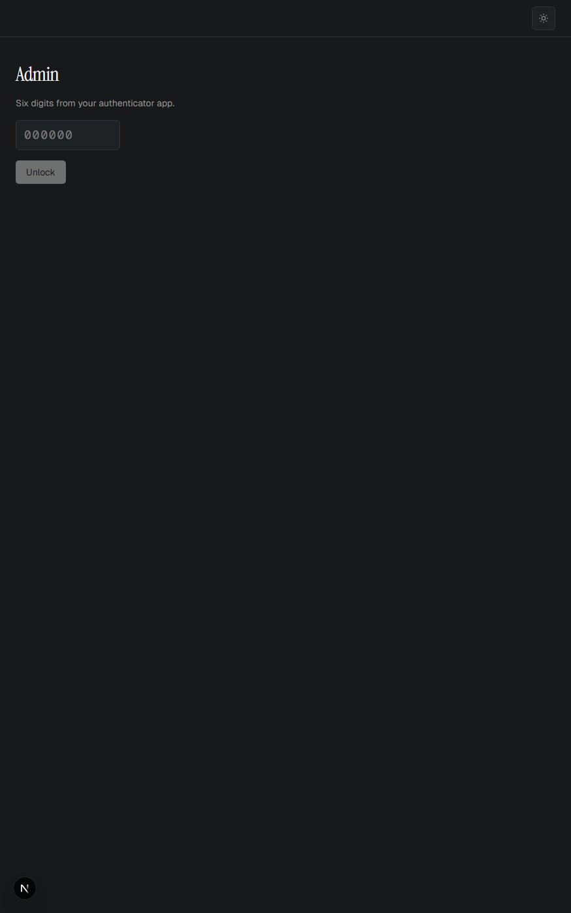

# Trustfall

Rent real things from strangers, with the money held by a smart contract and the arguments
settled by an AI agent that cannot pay itself.

Live demo: not deployed yet, coming to Vercel.

## What it does

- **Escrow that nobody can raid.** Rent and deposit go into a contract on Sepolia the moment
  a rental is requested. Trustfall cannot spend them, freeze them, or go under holding them.
- **Handover by signed code.** Collecting and returning the item are each confirmed by
  scanning a code the other person holds. It carries a nonce and an expiry, so an old
  screenshot is worth nothing.
- **A listing checker that has to explain itself.** Every listing is read by a model before
  it goes live, and a refusal comes with what to change and a way to submit again.
- **An arbitrator that proposes and never pays.** Disputes are read by a model that returns
  one of three words. It never sees an amount and never holds a key: the contract looks up
  the deposit it is already holding and does the arithmetic itself.
- **A gateway in front of both agents.** Every command an agent issues leaves over HTTP so a
  Latch policy can refuse it before the server signs anything.
- **A log that can be checked.** /admin shows every ruling, what the agent read, and each
  finding beside the source it claims to come from.

## Screenshots

### 1. The landing page

[](screenshots/homepage-light.jpg)

What somebody sees before signing in: what the escrow does, the three outcomes a dispute can
end in, and the real constants out of the contract rather than invented testimonials.

### 2. Dark mode

[](screenshots/homepage-dark.jpg)

Both themes are built from the same set of colour variables, so every screen followed
without a single component changing.

### 3. The agent log, locked

[](screenshots/admin-locked.jpg)

/admin is deliberately not part of the app: no navigation, no wallet, no footer. It is a
record about the app rather than a page that acts on anybody's behalf, and it is read only
because only the agent's address can settle a dispute on chain.

## How a rental goes

| Step | Who acts | What the contract does |
|---|---|---|
| Request | Renter | Takes rent and deposit into escrow, in one signature via USDC permit |
| Approve | Owner | Nothing moves |
| Check in | Owner signs the code, renter submits it | Starts the clock; rent stays in escrow |
| Check out | Renter signs the code, owner submits it | Works out the rent by hours used, pays the owner, refunds the unused days |
| Dispute | Either side, while renting or just after | Settles the rent, freezes the deposit for the arbitrator |
| Settle | The agent, or nobody | Splits the deposit one of three ways, or the timeout returns it to the renter |

## How a dispute is decided

Both sides file a statement and a photograph. The arbitrator is given them alongside
everything that existed before the argument started, oldest first: the listing photographs,
the check-in photograph, the check-out photograph.

It returns findings before it returns a verdict. Each finding names the source it came from,
and it may only name a source it was actually given, so a finding citing a photograph on a
dispute where none was filed is a hallucination the log catches by itself.

Below 0.6 confidence nothing is signed at all. There is no human resolver: seven days after
a dispute opens, anyone can finalise it and the deposit returns to the renter, which is the
contract treating an unjudged dispute as the platform's failure rather than the renter's.

## Tech stack

| Layer | What |
|---|---|
| Contracts | Solidity 0.8.24, Foundry for tests, Hardhat to deploy and verify |
| Frontend | Next.js 16, wagmi, viem, Tailwind v4 |
| Wallet | Privy, embedded wallets from an email address as well as browser wallets |
| Off-chain data | Supabase, Postgres and Storage |
| Agents | Google Gemini, `gemini-3.5-flash-lite` |
| Agent gateway | Latch |

## Deployed contracts (Sepolia)

| Contract | Address |
|---|---|
| RentalEscrow | [`0xf135EB8aBC8d058e0be8e293DF478DE3287CF2DD`](https://sepolia.etherscan.io/address/0xf135EB8aBC8d058e0be8e293DF478DE3287CF2DD#code) |
| MockUSDC | [`0xdAdE9118F11fc7b57d115ee45bf282aC12F01BBf`](https://sepolia.etherscan.io/address/0xdAdE9118F11fc7b57d115ee45bf282aC12F01BBf#code) |

Both verified. The USDC is a token this project wrote, with an open mint so anybody can try
the demo without asking for test money. The escrow does not care which ERC20 it holds: the
address is a constructor argument and immutable.

## Running it

```bash
npm run dev:all        # from the repo root
```

It reads `NEXT_PUBLIC_CHAIN_ID` from `frontend/.env.local`. Pointed at Sepolia it starts the
app alone; pointed at 31337 it starts a Hardhat node, deploys to it, and then starts the app.

Contract tests:

```bash
cd contracts && npm test
```

Agent tests, which spend real model calls:

```bash
cd frontend
npm run e2e:moderation     # 37 listings past the checker
npm run e2e:arbitration    # 36 checks on the arbitrator
```

## Layout

```
frontend/         Next.js. Also the backend: the API routes that hold the signing key
                  live in frontend/app/api.
contracts/        Solidity. Foundry runs the tests, Hardhat compiles and deploys.
services/         Files you paste into somebody else's dashboard. Nothing imports these.
CLAUDE.md         Project rules. Read this first.
UI-REFERENCE.md   Screen layouts and which Airbnb flows to copy.
ERROR.md          Every mistake worth not repeating, written at each commit.
```

**There is no `backend/` folder.** Next.js is full stack, so the server side of Trustfall is
a set of API routes inside `frontend/`, including the ones that hold the signing key.

**`services/` is not where integration code goes.** It holds only what you paste into a
vendor's dashboard, such as the SQL migrations. Integration code lives in `frontend/`,
because Next.js cannot import modules from outside its own package.

## What this deliberately does not do

No map or location filtering, no insurance, no identity verification, no deposit tiers, no
multiple languages, no reward token. It is one flow, done properly, on a testnet.

Two limits worth saying out loud rather than waiting to be asked:

**A blockchain cannot verify a physical object.** Every photograph here is filed by one of
the two people arguing. It can be old, a screenshot, or generated. What the chain guarantees
is that nobody could change it after it arrived and that the server wrote the timestamp.

**An agent can be argued with.** Statements and chat logs are written by people with an
interest in the outcome, so everything they wrote is wrapped in tags the policy treats as
evidence rather than instruction. It holds against a plain attempt to order a verdict, and
"holds against what we tried" is not the same as "cannot be broken".

## Status

Deployed to Sepolia and verified. Latch integration is wired but not yet configured against
the live gateway.
